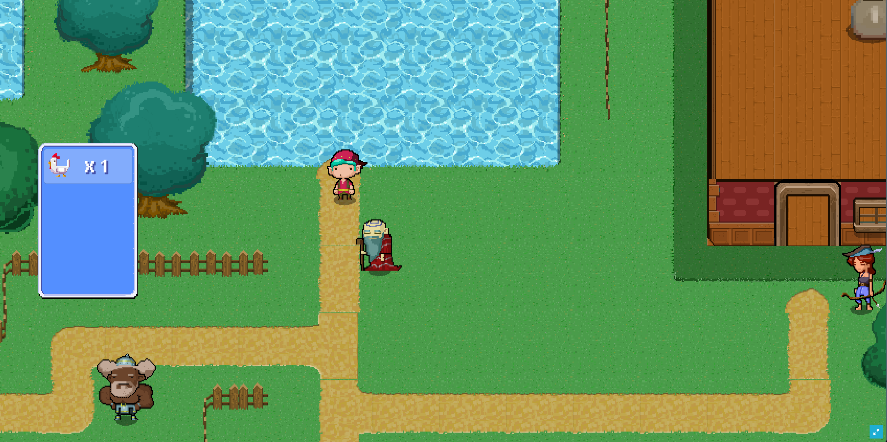

# 2D RPG Game

Build a 2D role-playing game in Unity using [GamingKit](https://portal.thirdweb.com/gamingkit)!

**Preview:** [Play the game!](https://unity-rpg-game.thirdweb-example.com/)


## How it works

Below, we'll outline the web3 features of the game enabled by [GamingKit](https://portal.thirdweb.com/gamingkit).

You can learn the features of the karting game itself from [Unity Learn: Karting Template](https://learn.unity.com/tutorial/get-started-with-the-creator-kit-rpg-2).

### Smart Contracts

This game utilises three smart contracts to manage the in-game assets.

| Contract                           | URL                                                                                                             |
| ---------------------------------- | --------------------------------------------------------------------------------------------------------------- |
| Token Drop (Golden Apple Currency) | [View Smart Contract](https://thirdweb.com/optimism-goerli/0x07E29106198B3b43Ada9A833Aee3e7CE74D38446)          |
| Edition (NFT Pots)                 | [View Smart Contract](https://thirdweb.com/optimism-goerli/0xaF99a50F4B36227B0E0b6db1593e413cF71548Ed/nfts)     |
| Marketplace (Buy Pots)             | [View Smart Contract](https://thirdweb.com/optimism-goerli/0x641c81F8c10e2958F4e0c00882014c0A3A03f86A/listings) |

### Connect Wallet

New users first connect their wallet to the game, this is achieved by:

1. [Instantiating the SDK](https://portal.thirdweb.com/gamingkit/setting-up/instantiating-the-sdk)
2. Requesting the user to [connect their wallet](https://portal.thirdweb.com/gamingkit/setting-up/connect-wallets)

```csharp
using Thirdweb;
using System.Threading.Tasks;

public class DemoClass : MonoBehaviour
{
    // Store the sdk so we can use it in any method of this classjb
    private ThirdwebSDK sdk;

    void OnEnable()
    {
        // When this becomes active, instantiate the SDK
        sdk = new ThirdwebSDK("optimism-goerli");
    }

    // When the user clicks "Connect Wallet":
    // - Ask them to connect their wallet
    // - Ask them to switch to Optimism Goerli network
    public async Task<string> EnsureWalletState()
    {
        string address = await sdk.wallet.Connect();
        await sdk.wallet.SwitchNetwork(420);
        return address;
    }
}
```

### Claiming ERC20 Tokens

Using the [Token Drop](https://portal.thirdweb.com/pre-built-contracts/token-drop) smart contract, users can claim ERC20 tokens from the game.

We prompt the user to claim tokens upon completing the wizard's quest, by:

1. Connecting to the smart contract.
2. Calling the `Claim` function.

```csharp
public Contract GetTokenDropContract()
{
    return sdk
        .GetContract("0x07E29106198B3b43Ada9A833Aee3e7CE74D38446");
}

public async Task<TransactionResult[]> Claim()
{
    var contract = GetTokenDropContract();
    await Connect();
    return await contract.ERC20.Claim("1");
}
```

> Note: Users can claim from the contract directly in this example. In a real game, you'd need to check the user has won the game before allowing them to receive tokens.

### Purchasing NFTs

We use the [Marketplace](https://portal.thirdweb.com/pre-built-contracts/marketplace) smart contract to allow users to purchase NFTs from the game.

This is achieved by:

1. Connecting to the smart contract.
2. Calling the `BuyListing` function.

```csharp
public Marketplace GetMarketplaceContract()
{
    return sdk
        .GetContract("0x641c81F8c10e2958F4e0c00882014c0A3A03f86A")
        .marketplace;
}
public async Task<TransactionResult> BuyItem(string itemId)
{
    await Connect();
    // itemId = ID of the listing on the marketplace, 1 = quantity to buy
    return await GetMarketplaceContract().BuyListing(itemId, 1);
}
```

## Got Questions?

Jump into our [Discord](https://discord.com/invite/thirdweb) to speak with our team directly!
